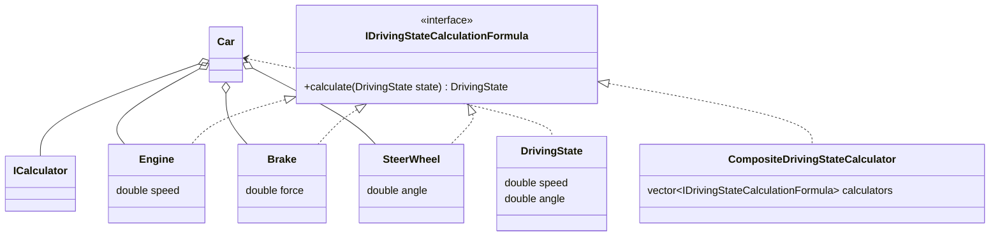

```mermaid

classDiagram

    Car o-- ICalculator
    Car o-- Engine
    Car o-- Brake
    Car o-- SteerWheel

    Car <.. DrivingState

    IDrivingStateCalculationFormula <|.. CompositeDrivingStateCalculator
    IDrivingStateCalculationFormula <|.. Brake
    IDrivingStateCalculationFormula <|.. Engine
    IDrivingStateCalculationFormula <|.. SteerWheel

    class DrivingState {
        double speed
        double angle
    }
    class CompositeDrivingStateCalculator {
        vector~IDrivingStateCalculationFormula~ calculators
    }
    class IDrivingStateCalculationFormula {
        <<interface>>
        +calculate(DrivingState state) DrivingState
    }
    class Brake {
        double force
    }
    class Engine {
        double speed
    }
    class SteerWheel {
        double angle
    }
```
