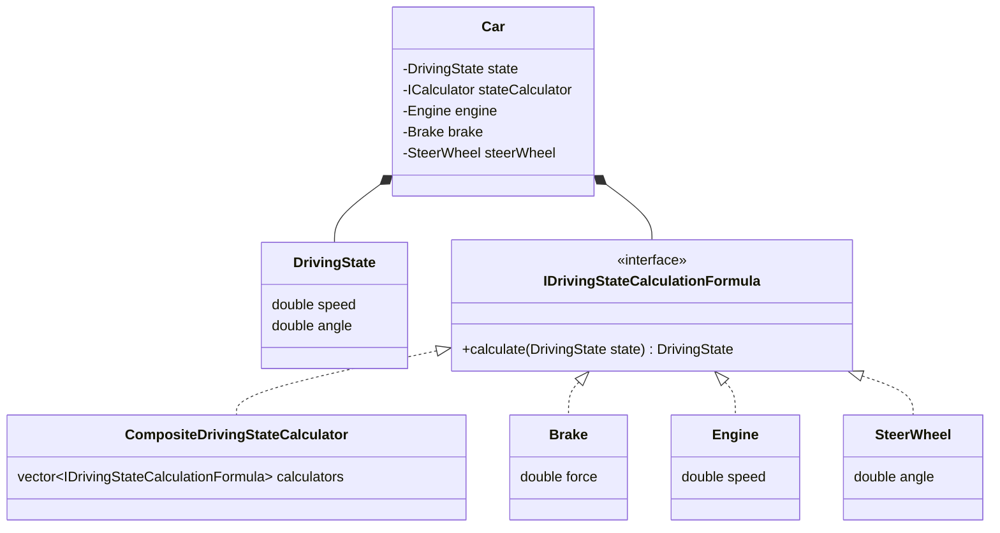

```mermaid

classDiagram
    Car *-- DrivingState
    Car *-- IDrivingStateCalculationFormula

    IDrivingStateCalculationFormula <|.. CompositeDrivingStateCalculator
    IDrivingStateCalculationFormula <|.. Brake
    IDrivingStateCalculationFormula <|.. Engine
    IDrivingStateCalculationFormula <|.. SteerWheel

    class Car {
        -DrivingState state
        -ICalculator stateCalculator
        -Engine engine
        -Brake brake
        -SteerWheel steerWheel
    }

    class DrivingState {
        double speed
        double angle
    }
    class CompositeDrivingStateCalculator {
        vector~IDrivingStateCalculationFormula~ calculators
    }
    class IDrivingStateCalculationFormula {
        <<interface>>
        +calculate(DrivingState state) DrivingState
    }
    class Brake {
        double force
    }
    class Engine {
        double speed
    }
    class SteerWheel {
        double angle
    }
```
